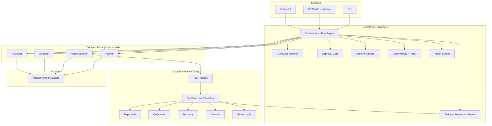
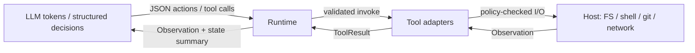
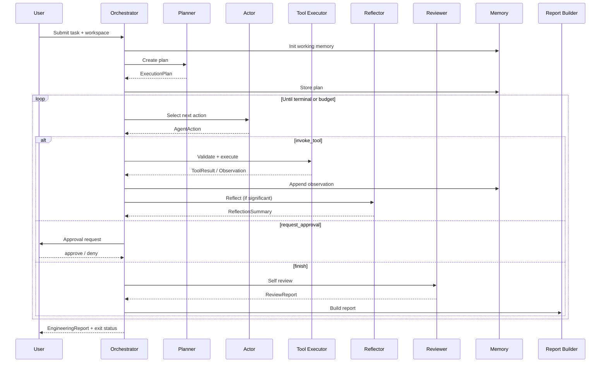
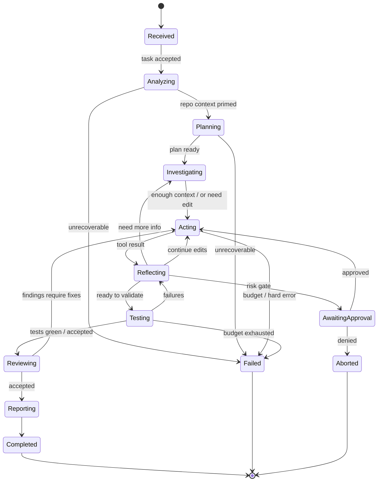

# ForgeMind Architecture Proposal

**Status:** Proposed  
**Audience:** Maintainers, contributors, coding agents  
**Date:** 2026-07-20  
**Scope:** Design only — no agent implementation yet

---

## 1. Executive summary

**ForgeMind** is an **Autonomous Software Engineering (ASE) Agent**: a production-oriented system that behaves like a software engineer, not a chatbot.

A user submits an engineering task. ForgeMind then:

1. Understands the task  
2. Analyzes the repository  
3. Creates an execution plan  
4. Decides what information it needs  
5. Chooses tools  
6. Reads and reasons about code  
7. Modifies files when allowed  
8. Runs tests  
9. Analyzes failures  
10. Reflects and revises  
11. Reviews its own changes  
12. Emits a final engineering report  

### Core separation of concerns

| Role | Owns | Must not own |
|------|------|--------------|
| **LLM (decision layer)** | Next action, tool choice, completeness judgment, plan revisions | Filesystem, shell, network, git mutation |
| **Runtime (control plane)** | Tools, permissions, execution, state, memory, safety, approvals | Open-ended “clever” side effects outside policy |

> The LLM never directly accesses the filesystem or executes commands. All side effects pass through **tool adapters** enforced by the runtime.

This is **not** a prompt wrapper, **not** a chatbot UI with tools bolted on, and **not** a LangChain workflow clone. The product is the **agent runtime**: planning, orchestration, memory, reflection, evaluation, and safe execution.

---

## 2. Design principles

1. **LLM decides; runtime controls** — decisions are model-driven; authority is application-driven.  
2. **Tool-mediated side effects only** — no raw FS/shell from the model.  
3. **Explicit run state** — every run is a durable state machine, not a hidden chat transcript.  
4. **Plan → act → observe → reflect** — closed loop with revisable plans.  
5. **Summarized reflection only** — store structured summaries; never expose private chain-of-thought.  
6. **Separate reviewer role** — self-review is a distinct component/pass, not the same turn as coding.  
7. **Human approval for risk** — commits, pushes, destructive ops, and policy-flagged edits require gates.  
8. **Testability first** — fakes for providers/tools; deterministic unit tests without live LLMs.  
9. **Provider agnostic** — OpenAI-compatible first; protocols over SDKs.  
10. **Framework independence** — no mandatory LangChain/LlamaIndex/crew dependency in the core.

Related ADRs: [`../adr/`](../adr/).

---

## 3. System architecture

### 3.1 Logical view



### 3.2 Trust boundary



The model proposes; the runtime validates, authorizes, executes, and returns **observations**.

---

## 4. Component design

### 4.1 Orchestrator (Run Engine)

**Responsibility:** Drive one `AgentRun` from intake to terminal state.

- Loads config and workspace binding  
- Initializes `RunState`  
- Transitions the state machine  
- Invokes planner / actor / reflector / reviewer at the right stages  
- Enforces budgets (max steps, max tool calls, timeouts, token/cost caps)  
- Emits events to observability  

**Does not:** parse repos itself, edit files, or call providers without going through ports.

### 4.2 Run State Machine

Single source of truth for “where we are.” See [§6](#6-agent-lifecycle--state-machine).

### 4.3 Planner

Produces and revises an `ExecutionPlan`:

- Ordered steps with goals and success criteria  
- Suspected files / areas  
- Risks and approval needs  
- Open questions  

Planner output is **structured data**, not free-form prose alone.

### 4.4 Action Selector (Actor)

Given current state + plan + recent observations, decides the next `AgentAction`:

- `invoke_tool`  
- `revise_plan`  
- `request_approval`  
- `run_tests`  
- `request_review`  
- `finish` / `abort`  

Uses constrained decoding / schema validation (JSON schema or equivalent). Invalid actions are rejected by the runtime (not executed).

### 4.5 Tool Registry & Executor

- Tools are **modular plugins** with declarative manifests  
- Manifest includes: name, description, input schema, risk class, required permissions  
- Executor validates inputs, checks policy, executes, wraps errors as `ToolResult`  
- Supports dry-run for mutable tools when configured  

### 4.6 Policy & Permission Engine

Capabilities are granted per run, e.g.:

| Permission | Examples |
|------------|----------|
| `repo.read` | list, search, read |
| `repo.write` | edit, write, delete (scoped paths) |
| `test.run` | pytest / project test command |
| `git.read` | status, diff, log |
| `git.write` | add, commit (approval) |
| `github.read` | issues, PR metadata |
| `github.write` | PR draft, comments (approval) |
| `network.egress` | usually denied by default |

Path allowlists / denylists apply (e.g. block `.env`, secrets, `.git/objects`).

### 4.7 Approval Gate

Blocks high-risk transitions until a human (or automated policy in CI mode) approves:

- File deletes outside scratch  
- Commits / pushes  
- GitHub mutations  
- Broad write scopes  
- Dependency / lockfile changes (configurable)

### 4.8 Memory Manager

**Working memory (run-scoped):**

- Task brief  
- Current plan  
- Files inspected  
- Action/observation log (structured)  
- Hypotheses / blockers (summaries)  
- Test results  

**Long-term memory (workspace / project-scoped):**

- Repository map summaries  
- Prior successful strategies  
- Known pitfalls  
- Indexed facts (not raw CoT)  

Retrieval is explicit (tools or memory APIs), budget-aware, and summarized before model injection.

### 4.9 Reflector

After significant actions (and on test failure), produces a `ReflectionSummary`:

- What changed in understanding  
- Whether the last action helped  
- Plan adjustments  
- Continue / retry / escalate / stop  

Only summaries are persisted and shown in reports.

### 4.10 Reviewer (separate role)

A distinct pass (possibly different prompt/profile/model) that reviews:

- Diff quality  
- Correctness risks  
- Security issues  
- Missing tests / edge cases  
- Regression risks  

Outputs `ReviewReport` with findings and severity. Can send the run back to `EXECUTING` or `TESTING`.

### 4.11 Code Intelligence (repository understanding)

Layer over tools that builds durable context:

- Tree / ownership map  
- Language & dependency detection  
- Symbol / text search facades  
- Optional AST helpers (e.g. tree-sitter) in later phases  

Does not replace tools; it structures their outputs for planning and memory.

### 4.12 Test Loop Controller

Specialized policy inside the orchestrator:

```text
modify → run_tests → analyze_failures → reflect → (retry | escalate | finish)
```

Tracks iteration count and flakiness signals; prevents infinite repair loops.

### 4.13 Report Builder

Produces the final **Engineering Report**:

- Task restatement  
- Plan (final)  
- Key findings  
- Changes made (file list + rationale)  
- Tests run / results  
- Review findings  
- Residual risks / follow-ups  
- Trace / run ID for audit  

### 4.14 Model Provider Adapter

Port for chat/completions (and later tool-calling native APIs). Streaming optional. Stub provider for tests.

### 4.15 Surfaces

- **CLI** (primary early surface)  
- **HTTP API** (optional)  
- Future IDE / UI bindings consume the same orchestrator

---

## 5. Data flow

### 5.1 Happy-path sequence



### 5.2 Core data objects

| Object | Purpose |
|--------|---------|
| `TaskSpec` | User goal, constraints, workspace root, mode |
| `RunState` | State machine status + counters + timestamps |
| `ExecutionPlan` | Steps, criteria, risks |
| `AgentAction` | Discriminated union of allowed next moves |
| `ToolCall` / `ToolResult` | Validated I/O envelopes |
| `Observation` | Normalized tool outcome for the model |
| `MemorySnapshot` | Working + retrieved long-term slices |
| `ReflectionSummary` | Post-action evaluation (safe to store) |
| `ReviewReport` | Self-review findings |
| `ApprovalRequest` | Human gate payload |
| `EngineeringReport` | Final deliverable |
| `TraceEvent` | Observability stream |

All public objects are typed (Pydantic / dataclasses) and serializable for resume and audit.

---

## 6. Agent lifecycle & state machine

### 6.1 States



### 6.2 State responsibilities

| State | Runtime does | LLM may decide |
|-------|--------------|----------------|
| `Received` | Validate task, bind workspace | — |
| `Analyzing` | Allow read-only repo tools | What to inspect next |
| `Planning` | Persist plan | Plan content |
| `Investigating` | Read/search tools | Next inspection |
| `Acting` | Write tools (policy) | Edits / writes |
| `Reflecting` | Store summary | Continue/retry/revise |
| `Testing` | Test tools | Interpret failures (via actor/reflector) |
| `Reviewing` | Diff tools + reviewer pass | Findings (reviewer role) |
| `AwaitingApproval` | Pause; notify human | — |
| `Reporting` | Build report | Optional prose polish |
| `Completed` / `Failed` / `Aborted` | Finalize artifacts | — |

### 6.3 Transition guards

- Permission checks  
- Budget checks  
- Schema validation of `AgentAction`  
- Approval requirements by risk class  
- Workspace path confinement  

Illegal transitions raise typed errors and become trace events; they do not silently mutate host state.

---

## 7. Repository structure (target)

Aligns with the existing bootstrap, extended for ASE concerns:

```text
ForgeMind/
├── .ai/                         # Guidance for humans & coding agents
├── docs/
│   ├── architecture/            # This proposal + diagrams
│   ├── adr/                     # Architecture Decision Records
│   ├── engineering/             # Process, testing, tooling
│   └── phases/                  # Per-phase design notes (as phases land)
├── configs/                     # Example run policies & agent profiles
├── examples/                    # Recipes (later phases)
├── scripts/                     # Dev utilities
├── src/forgemind/
│   ├── core/                    # Types, errors, protocols, actions
│   ├── config/                  # Settings & policy loading
│   ├── providers/               # Model adapters
│   ├── tools/                   # Registry, executor, built-in tools
│   │   ├── repo/                # structure, search, read
│   │   ├── edit/                # patch / write
│   │   ├── test/                # test runners
│   │   ├── git/                 # status, diff, commit prep
│   │   └── github/              # issues, PR drafts
│   ├── memory/                  # Working + long-term
│   ├── planning/                # Planner interfaces & schemas
│   ├── reflection/              # Reflector
│   ├── review/                  # Reviewer component
│   ├── policy/                  # Permissions & path rules
│   ├── approval/                # Human gates
│   ├── agent/                   # Orchestrator + state machine
│   ├── intelligence/            # Repo understanding helpers
│   ├── reporting/               # Engineering reports
│   ├── observability/           # Traces & logs
│   ├── cli/                     # CLI surface
│   ├── api/                     # Optional HTTP
│   ├── plugins/                 # Extension loading
│   └── eval/                    # Scenario evals
└── tests/
    ├── unit/
    ├── integration/
    └── fixtures/                # Tiny sample repos for agent tests
```

Module names may be introduced gradually; empty packages already reserved under `src/forgemind/` will be renamed/extended as phases require (prefer additive evolution over big-bang renames).

---

## 8. Module responsibilities (summary)

| Module | Responsibility |
|--------|----------------|
| `core` | Shared types, action schemas, errors, ports |
| `config` | Run config, profiles, budgets |
| `policy` | Permissions, path rules, risk classes |
| `providers` | LLM adapters + stubs |
| `planning` | Plan schema + planner port |
| `agent` | Orchestrator, state machine, budgets |
| `tools` | Registry, validation, execution |
| `memory` | Working/long-term stores + retrieval |
| `reflection` | Reflection summaries |
| `review` | Self code review |
| `intelligence` | Repo map / context assembly |
| `approval` | Human-in-the-loop gates |
| `reporting` | Final engineering report |
| `observability` | Traces, metrics hooks |
| `cli` / `api` | User surfaces |
| `plugins` | External tool packs |
| `eval` | Golden tasks on fixture repos |

---

## 9. Technology choices

| Concern | Choice | Rationale |
|---------|--------|-----------|
| Language | Python 3.11+ | Ecosystem, typing, OSS contributor base |
| Packaging | `src` layout + Hatchling | Standard, testable installs |
| Models / schemas | Pydantic v2 | Validation, JSON schema for tool/action contracts |
| LLM access | Provider protocol + OpenAI-compatible HTTP first | Portable; easy to stub |
| Orchestration | Custom run engine | Avoid framework lock-in; ASE-specific state machine |
| CLI | Typer or argparse (decide in CLI phase) | Thin surface over orchestrator |
| HTTP (optional) | FastAPI | Clear OpenAPI; optional extra |
| Persistence | JSONL traces + SQLite for long-term memory (initial) | Simple, local-first, inspectable |
| Code search | ripgrep-backed tool + optional tree-sitter later | Fast, familiar, incremental complexity |
| Tests | pytest + coverage | Already bootstrapped |
| Lint/types | Ruff + mypy strict | Already bootstrapped |
| Git | Subprocess/tool wrappers (not model-direct) | Safety + testability |
| GitHub | REST/GraphQL behind tools + approval | Explicit risk boundary |

### Explicit non-choices (core)

- LangChain / LlamaIndex / CrewAI as the **core** runtime  
- Giving the model a raw shell  
- Storing private chain-of-thought in memory or reports  
- Auto-push to `main` without approval  

---

## 10. Safety model

1. **Confinement** — workspace root jail; symlink escape checks  
2. **Least privilege** — default read-only; write/test/git escalate explicitly  
3. **Schema validation** — reject malformed tool calls  
4. **Risk classes** — `read` / `write` / `exec` / `mutate_git` / `mutate_remote`  
5. **Approval gates** — human confirm for high risk  
6. **Secret hygiene** — deny patterns for env/keys; redact traces  
7. **Budgets** — hard stop on steps/time/cost  
8. **Reviewer pass** — mandatory before “success” in standard profile  
9. **Auditability** — full tool trace for each run  

---

## 11. Development phases (aligned)

Phases remain independently shippable. Detail lives in [`ROADMAP.md`](../../ROADMAP.md).

| Phase | Focus |
|------:|-------|
| 0 | Repository foundation *(done / active bootstrap)* |
| 1 | Core types, actions, protocols |
| 2 | Config, budgets, policy engine |
| 3 | Model provider adapters + stubs |
| 4 | Tool system + read-only repo tools |
| 5 | Memory (working + long-term interfaces) |
| 6 | Orchestrator + state machine (read-only autonomous loop) |
| 7 | Planner + reflection |
| 8 | Write tools + test loop |
| 9 | Reviewer + engineering report |
| 10 | Observability & run replay |
| 11 | CLI product surface |
| 12 | Approval gates + git tools |
| 13 | GitHub integration (draft PR / issues) |
| 14 | Plugins, evals, hardening, release |

Agent *behavior* begins in Phase 6 (read-only). Mutation and test loops land in Phase 8. This preserves safety while proving the runtime early.

---

## 12. Testing strategy (architecture level)

| Layer | What it proves |
|-------|----------------|
| Unit | Schemas, policy decisions, state transitions, tool validation |
| Integration | Orchestrator with stub LLM + fake tools on fixture repos |
| Contract | Provider adapter request/response normalization |
| Eval | Golden ASE tasks (“fix failing test”, “explain module”) with stub or recorded models |
| Safety | Jail escape attempts, denied permissions, approval blocking |

Live-model demos are optional and never required for CI green.

---

## 13. Open decisions (to resolve in ADRs / early phases)

1. Patch strategy: full-file write vs unified diff apply vs AST edits  
2. Multi-agent vs single-agent multi-role (planner/actor/reviewer as roles sharing one runtime) — **proposal default: single orchestrator, multiple roles**  
3. Long-term memory backend beyond SQLite  
4. Whether native provider tool-calling is required in Phase 3 or emulated via JSON actions  
5. Default approval UX (CLI prompt vs file flag vs API webhook)  

---

## 14. Success criteria for the architecture

The architecture is successful if:

1. A stub LLM can drive a full run through tools without any host bypass  
2. Permissions can make the same agent safely read-only or read-write  
3. Runs are resumable from serialized `RunState`  
4. Reflection and review never require exposing private CoT  
5. New tools are addable via registry/plugins without changing the orchestrator core  
6. Contributors can understand the system from this doc + ADRs + roadmap alone  

---

## 15. Next step

After acceptance of this proposal:

1. File/confirm ADRs in `docs/adr/`  
2. Align package stubs and roadmap checkboxes  
3. Begin **Phase 1 — Core types and contracts** on a feature branch  

No implementation code should land until Phase 1 starts by explicit request.
